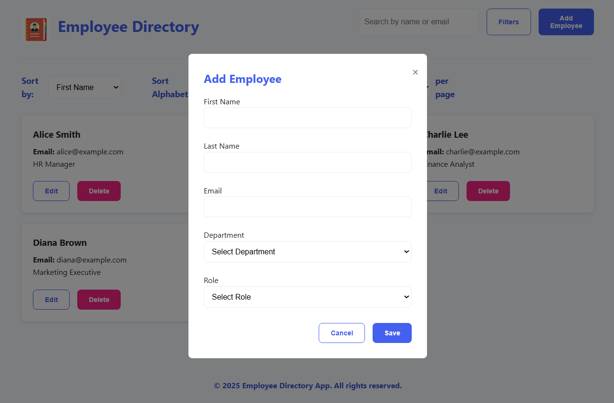
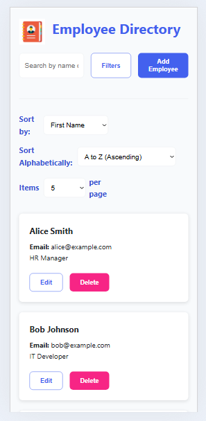
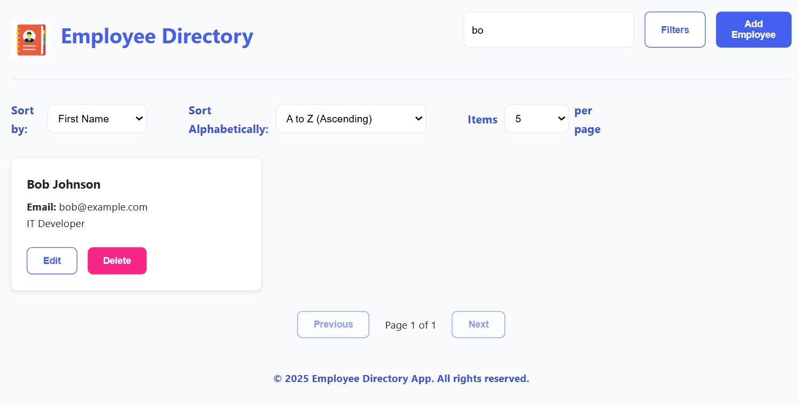
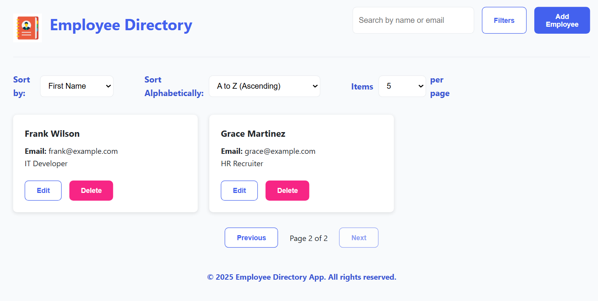
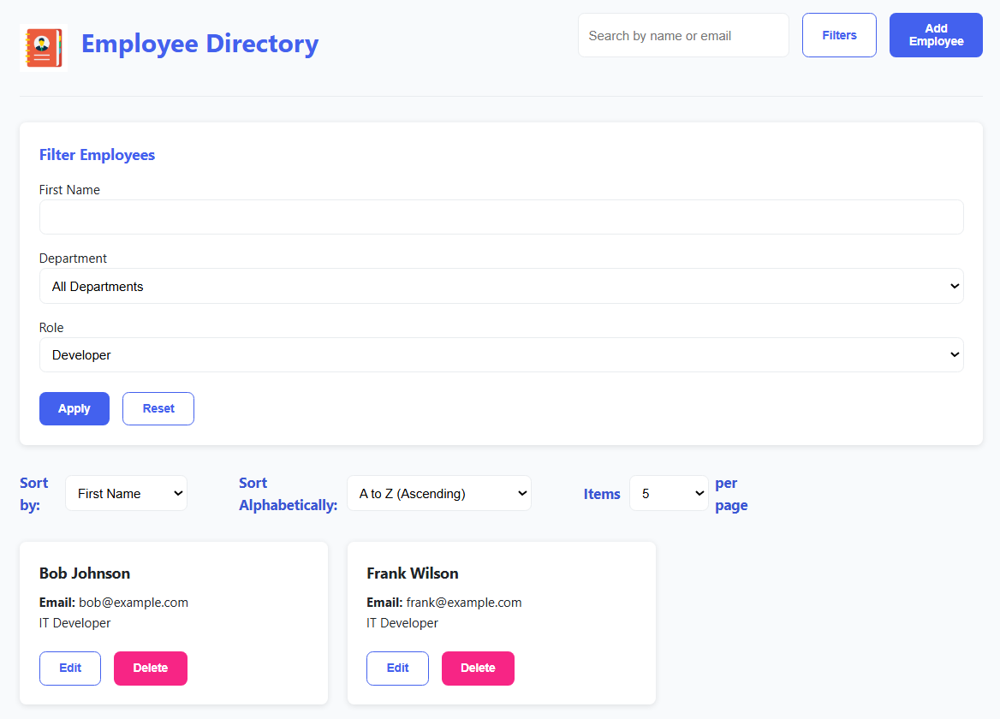

# Employee Directory

A responsive web application for managing employee records with filtering, sorting, and pagination capabilities.

## 🚀 Features

- **CRUD Operations:** Add, view, edit, and delete employee records
- **Advanced Filtering:** Filter by name, department, and role
- **Search:** Global search across name and email fields
- **Sorting:** Sort by multiple fields in ascending/descending order
- **Pagination:** Configurable items per page
- **Responsive Design:** Works seamlessly on desktop and mobile devices
- **Form Validation:** Client-side validation with clear error messages
- **Local Storage:** Persists data between sessions

## 📋 Prerequisites

- Java 11 or higher
- Maven 3.6 or higher
- Spring Boot 2.7.x
- Modern web browser (Chrome, Firefox, Safari, Edge)

## 🛠️ Setup & Installation

1. **Clone the repository**

   ```bash
   git clone https://github.com/premasagarbontula/employee-directory.git
   cd employee-directory

   ```

2. Build the project
   mvn clean install

3. Run the application
   mvn spring-boot:run

4. Access the application
   Open your browser and navigate to:
   http://localhost:8080

🗂️ Project Structure

        employee-directory/
    ├── src/
    │   ├── main/
    │   │   ├── java/
    │   │   │   └── com/example/employeedirectory/
    │   │   │       ├── Application.java
    │   │   │       └── HomeController.java
    │   │   └── resources/
    │   │       ├── static/
    │   │       │   ├── css/
    │   │       │   │   ├── base.css
    │   │       │   │   ├── components.css
    │   │       │   │   └── layout.css
    │   │       │   └── js/
    │   │       │       ├── app.js
    │   │       │       ├── data.js
    │   │       │       └── form.js
    │   │       ├── templates/
    │   │       │   └── index.ftlh
    │   │       └── application.properties
    └── README.md

🔧 Technical Implementation

    1. Frontend:
        Pure JavaScript with no external dependencies
        Modular code organization (app.js, data.js, form.js)
        CSS with responsive design principles
        FreeMarker templates for server-side rendering

    2. Backend:
        Spring Boot for server-side implementation
        RESTful architecture principles
        Local storage for data persistence

🎯 Core Features Explained

    1. Data Management
        Uses LocalStorage for client-side data persistence
        CRUD operations with validation and error handling
        Email uniqueness validation

    2. Search & Filter
        Real-time search across multiple fields
        Multiple filter criteria support
        Debounced search input for performance

    3. UI/UX Features
        Responsive card layout for employee records
        Modal forms for add/edit operations
        Toast notifications for operation feedback
        Confirmation dialogs for destructive actions

🔄 State Management

    Centralized state management in data.js
    Event-driven updates using CustomEvents
    Persistent storage using localStorage

🚧 Challenges Faced

    1. State Management:
        Maintaining consistent state across components

    2. Form Validation:
        Implementing comprehensive client-side validation
        Handling email uniqueness checks

    3. Performance:
        Optimizing filter and sort operations
        Managing DOM updates efficiently

🔜 Future Improvements

    1. Technical Enhancements:
        Implement proper backend API
        Add database integration
        Implement user authentication

    2. Feature Additions:
        Export to CSV/Excel
        Image upload for employee profiles

📱 Screenshots

    ### Desktop Interface
    

    ### Add Employee Form
    

    ### Mobile Experience
    

    ### Search Functionality
    

    ### Pagination System
    

    ### Advanced Filtering
    

📄 License
This project is licensed under the MIT License - see the LICENSE file for details.

👤 Author
Prema Sagar Bontula
GitHub: @premasagarbontula
LinkedIn: https://www.linkedin.com/in/premasagarbontula/

🙏 Acknowledgments
Spring Boot team for the excellent framework
FreeMarker template engine
The open-source community
